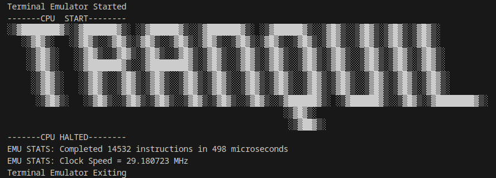

# Tranquil - An Experimental* ARM Emulator
*Experimental in this case means filled with bugs and is unfaithful in many ways to the actual ARM architecture in ways I could not forsee (or could forsee and know are problems, writing an emulator is hard)
# Features
- Compatible with my ARM Assembler, [Neurotic](https://github.com/power-emma/Neurotic)
- Reads in Binary code from a file
- Implements 16 (and Growing) Data Processing, Branching, and Memory Store/Load instructions
- UART Terminal Emulator for data output
- Debug mode for step-by-step instruction viewing
